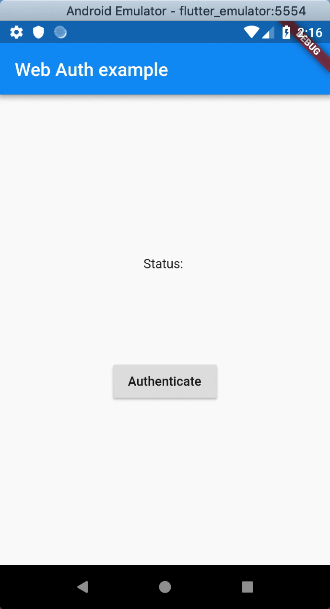
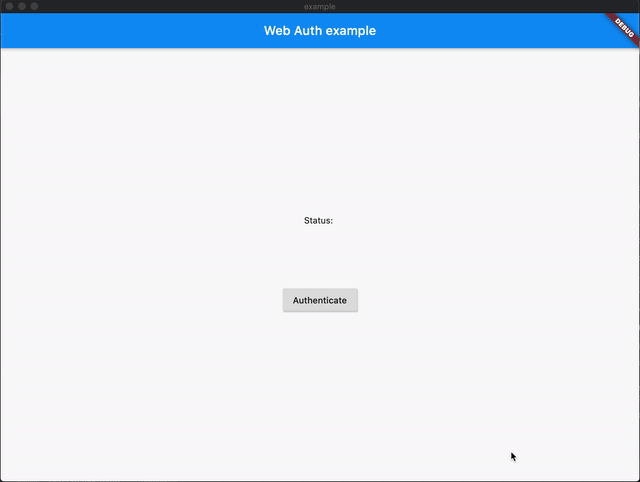

# Web Auth for Flutter

A Flutter plugin for authenticating a user with a web service, even if the web service is run by a third party. Most commonly used with OAuth2, but can be used with any web flow that can redirect to a custom scheme.

In the background, this plugin uses [`ASWebAuthenticationSession`][ASWebAuthenticationSession] on iOS 12+ and macOS 10.15+, [`SFAuthenticationSession`][SFAuthenticationSession] on iOS 11, [Chrome Custom Tabs][Chrome Custom Tabs] on Android and opens a new window on Web. You can build it with iOS 8+, but it is currently only supported by iOS 11 or higher.

[ASWebAuthenticationSession]: https://developer.apple.com/documentation/authenticationservices/aswebauthenticationsession
[SFAuthenticationSession]: https://developer.apple.com/documentation/safariservices/sfauthenticationsession
[Chrome Custom Tabs]: https://developer.chrome.com/multidevice/android/customtabs

| **iOS**                | **Android**                    |
| ---------------------- | ------------------------------ |
|  |  |

| **macOS**                  |
| -------------------------- |
|  |

## Usage

To authenticate against your own custom site:

```dart
import 'package:flutter_web_auth/flutter_web_auth.dart';

// Present the dialog to the user
final result = await FlutterWebAuth.authenticate(url: "https://my-custom-app.com/connect", callbackUrlScheme: "my-custom-app");

// Extract token from resulting url
final token = Uri.parse(result).queryParameters['token']
```

To authenticate the user using Google's OAuth2:

```dart
import 'package:flutter_web_auth/flutter_web_auth.dart';

import 'dart:convert' show jsonDecode;
import 'package:http/http.dart' as http;

// App specific variables
final googleClientId = 'XXXXXXXXXXXX-xxxxxxxxxxxxxxxxxxxxxxxxxxxxxxxx.apps.googleusercontent.com';
final callbackUrlScheme = 'com.googleusercontent.apps.XXXXXXXXXXXX-xxxxxxxxxxxxxxxxxxxxxxxxxxxxxxxx';

// Construct the url
final url = Uri.https('accounts.google.com', '/o/oauth2/v2/auth', {
  'response_type': 'code',
  'client_id': googleClientId,
  'redirect_uri': '$callbackUrlScheme:/',
  'scope': 'email',
});

// Present the dialog to the user
final result = await FlutterWebAuth.authenticate(url: url.toString(), callbackUrlScheme: callbackUrlScheme);

// Extract code from resulting url
final code = Uri.parse(result).queryParameters['code'];

// Use this code to get an access token
final response = await http.post('https://www.googleapis.com/oauth2/v4/token', body: {
  'client_id': googleClientId,
  'redirect_uri': '$callbackUrlScheme:/',
  'grant_type': 'authorization_code',
  'code': code,
});

// Get the access token from the response
final accessToken = jsonDecode(response.body)['access_token'] as String;
```

## Setup

Setup works as for any Flutter plugin, expect the Android and Web caveats outlined below:

### Android

In order to capture the callback url, the following `activity` needs to be added to your `AndroidManifest.xml`. Be sure to relpace `YOUR_CALLBACK_URL_SCHEME_HERE` with your actual callback url scheme.

```xml
<manifest>
  <application>

    <activity android:name="com.linusu.flutter_web_auth.CallbackActivity" >
      <intent-filter android:label="flutter_web_auth">
        <action android:name="android.intent.action.VIEW" />
        <category android:name="android.intent.category.DEFAULT" />
        <category android:name="android.intent.category.BROWSABLE" />
        <data android:scheme="YOUR_CALLBACK_URL_SCHEME_HERE" />
      </intent-filter>
    </activity>

  </application>
</manifest>
```

### Web

On the Web platform an endpoint needs to be created that captures the callback URL and sends it to the application using the JavaScript `postMessage()` method. In the `./web` folder of the project, create an HTML file with the name e.g. `auth.html` with content:

```html
<!DOCTYPE html>
<title>Authentication complete</title>
<p>Authentication is complete. If this does not happen automatically, please
close the window.
<script>
  window.opener.postMessage({
    'flutter-web-auth': window.location.href
  }, window.location.origin);
  window.close();
</script>
```

Redirection URL passed to the authentication service must be the same as the URL on which the application is running (schema, host, port if necessary) and the path must point to created HTML file, `/auth.html` in this case. The `callbackUrlScheme` parameter of the `authenticate()` method does not take into account, so it is possible to use a schema for native platforms in the code.

For the Sign in with Apple in web_message response mode, postMessage from https://appleid.apple.com is also captured, and the authorization object is returned as a URL fragment encoded as a query string (for compatibility with other providers).
