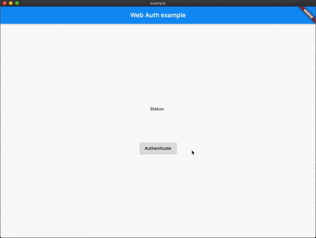

# Web Auth for Flutter

A Flutter plugin for authenticating a user with a web service, even if the web service is run by a third party. Most commonly used with OAuth2, but can be used with any web flow that can redirect to a custom scheme.

In the background, this plugin uses [`ASWebAuthenticationSession`][ASWebAuthenticationSession] on iOS 12+ and macOS 10.15+, [`SFAuthenticationSession`][SFAuthenticationSession] on iOS 11, [Chrome Custom Tabs][Chrome Custom Tabs] on Android and opens a new window on Web. You can build it with iOS 8+, but it is currently only supported by iOS 11 or higher.

[ASWebAuthenticationSession]: https://developer.apple.com/documentation/authenticationservices/aswebauthenticationsession
[SFAuthenticationSession]: https://developer.apple.com/documentation/safariservices/sfauthenticationsession
[Chrome Custom Tabs]: https://developer.chrome.com/multidevice/android/customtabs

| **iOS**                | **Android**                    |
| ---------------------- | ------------------------------ |
|  |  |

| **macOS**                  |
| -------------------------- |
|  |

## Usage

To authenticate against your own custom site:

```dart
import 'package:flutter_web_auth/flutter_web_auth.dart';

// Present the dialog to the user
final result = await FlutterWebAuth.authenticate(url: "https://my-custom-app.com/connect", callbackUrlScheme: "my-custom-app");

// Extract token from resulting url
final token = Uri.parse(result).queryParameters['token']
```

To authenticate the user using Google's OAuth2:

```dart
import 'package:flutter_web_auth/flutter_web_auth.dart';

import 'dart:convert' show jsonDecode;
import 'package:http/http.dart' as http;

// App specific variables
final googleClientId = 'XXXXXXXXXXXX-xxxxxxxxxxxxxxxxxxxxxxxxxxxxxxxx.apps.googleusercontent.com';
final callbackUrlScheme = 'com.googleusercontent.apps.XXXXXXXXXXXX-xxxxxxxxxxxxxxxxxxxxxxxxxxxxxxxx';

// Construct the url
final url = Uri.https('accounts.google.com', '/o/oauth2/v2/auth', {
  'response_type': 'code',
  'client_id': googleClientId,
  'redirect_uri': '$callbackUrlScheme:/',
  'scope': 'email',
});

// Present the dialog to the user
final result = await FlutterWebAuth.authenticate(url: url.toString(), callbackUrlScheme: callbackUrlScheme);

// Extract code from resulting url
final code = Uri.parse(result).queryParameters['code'];

// Use this code to get an access token
final response = await http.post('https://www.googleapis.com/oauth2/v4/token', body: {
  'client_id': googleClientId,
  'redirect_uri': '$callbackUrlScheme:/',
  'grant_type': 'authorization_code',
  'code': code,
});

// Get the access token from the response
final accessToken = jsonDecode(response.body)['access_token'] as String;
```

**Note:** To use multiple scopes with Google, you need to encode them as a single string, separated by spaces. For example, `scope: 'email https://www.googleapis.com/auth/userinfo.profile'`. Here is [a list of all supported scopes](https://developers.google.com/identity/protocols/oauth2/scopes).

## Setup

Setup works as for any Flutter plugin, expect the Android and Web caveats outlined below:

### Android

In order to capture the callback url, the following `activity` needs to be added to your `AndroidManifest.xml`. Be sure to relpace `YOUR_CALLBACK_URL_SCHEME_HERE` with your actual callback url scheme.

```xml
<manifest>
  <application>

    <activity android:name="com.linusu.flutter_web_auth.CallbackActivity" android:exported="true">
      <intent-filter android:label="flutter_web_auth">
        <action android:name="android.intent.action.VIEW" />
        <category android:name="android.intent.category.DEFAULT" />
        <category android:name="android.intent.category.BROWSABLE" />
        <data android:scheme="YOUR_CALLBACK_URL_SCHEME_HERE" />
      </intent-filter>
    </activity>

  </application>
</manifest>
```

### Web

On the Web platform an endpoint needs to be created that captures the callback URL and sends it to the application using the JavaScript `postMessage()` method. In the `./web` folder of the project, create an HTML file with the name e.g. `auth.html` with content:

```html
<!DOCTYPE html>
<title>Authentication complete</title>
<p>Authentication is complete. If this does not happen automatically, please
close the window.
<script>
  window.opener.postMessage({
    'flutter-web-auth': window.location.href
  }, window.location.origin);
  window.close();
</script>
```

Redirection URL passed to the authentication service must be the same as the URL on which the application is running (schema, host, port if necessary) and the path must point to created HTML file, `/auth.html` in this case. The `callbackUrlScheme` parameter of the `authenticate()` method does not take into account, so it is possible to use a schema for native platforms in the code.

For the Sign in with Apple in web_message response mode, postMessage from https://appleid.apple.com is also captured, and the authorization object is returned as a URL fragment encoded as a query string (for compatibility with other providers).

## Troubleshooting

When you use this package for the first time, there are some problems you may have. These are some of the common solutions

### Troubleshooting `callbackUrlScheme`

- `callbackUrlScheme` must be a valid schema string or else this wont work.
- A valid RFC 3986 URL scheme must consist of "a letter and followed by any combination of letters, digits, plus ("+"), period ("."), or hyphen ("-")."
- scheme = ALPHA *( ALPHA / DIGIT / "+" / "-" / "." )
- This means you can not use underscore "_", space " " or uppercase "ABCDEF...". You can not also start with a number. See [RFC3986#page-17](https://www.rfc-editor.org/rfc/rfc3986#page-17)
- examples of VALID  `callbackUrlScheme` are `callback-scheme`, `another.scheme`, `examplescheme`
- examples of INVALID  `callbackUrlScheme` are `callback_scheme`,`1another.scheme`, `exampleScheme`

### Troubleshooting Flutter App

- You have to tell the `FlutterWebAuth.authenticate` function what your `callbackUrlScheme` is.
- Example if your `callbackUrlScheme` is  `valid-callback-scheme`, your dart code will look like

    ```dart
    import 'package:flutter_web_auth/flutter_web_auth.dart';

    // Present the dialog to the user
    final result = await FlutterWebAuth.authenticate(url: "https://my-custom-app.com/connect", callbackUrlScheme: "valid-callback-scheme");
    ```

### Troubleshooting Android

- You are required to update your `AndroidManifest.xml` to include the `com.linusu.flutter_web_auth.CallbackActivity` activity something like

    ```xml
    <manifest>
      <application>

        <!-- add the com.linusu.flutter_web_auth.CallbackActivity activity -->
        <activity android:name="com.linusu.flutter_web_auth.CallbackActivity" android:exported="true">
          <intent-filter android:label="flutter_web_auth">
            <action android:name="android.intent.action.VIEW" />
            <category android:name="android.intent.category.DEFAULT" />
            <category android:name="android.intent.category.BROWSABLE" />
            <data android:scheme="YOUR_CALLBACK_URL_SCHEME_HERE" />
          </intent-filter>
        </activity>

      </application>
    </manifest>
    ```

- Example of valid `AndroidManifest.xml` with VALID `callbackUrlScheme`. in the example below `valid-callback-scheme` is our `callbackUrlScheme`

    ```xml
    <manifest>
      <application>

        <activity android:name="com.linusu.flutter_web_auth.CallbackActivity" android:exported="true">
          <intent-filter android:label="flutter_web_auth">
            <action android:name="android.intent.action.VIEW" />
            <category android:name="android.intent.category.DEFAULT" />
            <category android:name="android.intent.category.BROWSABLE" />
            <data android:scheme="valid-callback-scheme" />
          </intent-filter>
        </activity>

      </application>
    </manifest>
    ```

- If you are targeting S+ (version 31 and above) you need to provide an explicit value for `android:exported`. If you followed earlier installation instructions this was not included. Make sure that you add `android:exported="true"` to the `com.linusu.flutter_web_auth.CallbackActivity` activity in your `AndroidManifest.xml` file.

    ```diff
    - <activity android:name="com.linusu.flutter_web_auth.CallbackActivity">
    + <activity android:name="com.linusu.flutter_web_auth.CallbackActivity" android:exported="true">
    ```

### Troubleshooting OAuth redirects

- Your OAuth Provider must redirect to the valid  `callbackUrlScheme` + `://`. This mean if your  `callbackUrlScheme` is `validscheme`, your OAuth Provider must redirect to `validscheme://`
- Example with `php`
    ```php
    <?php

    header("Location: validscheme://?data1=value1&data2=value2");
    ```

### Troubleshooting HTML redirects

- If you are using HTML hyperlinks, it must be a valid `callbackUrlScheme` + `://`. This mean if your `callbackUrlScheme` is `customappname`, your html hyperlink should be `customappname://`
- example with `HTML`

    ```html
    <a href="customappname://?data1=value1&data2=value2">Go Back to App</a>
    ```

### Troubleshooting passing data to app

- You can pass data back to your app by adding GET query parameters. This means by adding name=value type of data after your `callbackUrlScheme` + `://` + `?`
- example to pass `access-token` to your app a valid url for that could be

    ```text
    my-callback-schema://?access-token=jdu9292s
    ```

- You can pass multipe data by concatenating with `&`

    ```text
    my-callback-schema://?data1=value1&data2=value2
    ```

- example to pass `access-token` and `user_id` to your app a valid url for that could be

    ```text
    my-callback-schema://?access-token=jdu9292s&user_id=23
    ```

- You can get the data in your app by using `Uri.parse(result).queryParameters`

    ```dart
    // Present the dialog to the user
    final result = await FlutterWebAuth.authenticate(url: "https://my-custom-app.com/connect", callbackUrlScheme: "valid-callback-scheme");
    // Extract token from resulting url
    String accessToken = Uri.parse(result).queryParameters['access-token'];
    String userId = Uri.parse(result).queryParameters['user_id'];
    ```

### Cannot open keyboard on iOS

This seems to be a bug in `ASWebAuthenticationSession`, and no work around have been found. Please see [issue #120](https://github.com/LinusU/flutter_web_auth/issues/120) for more info.

### Error on macOS if Chrome is default browser

This seems to be a bug in `ASWebAuthenticationSession`, and no work around have been found. Please see [issue #136](https://github.com/LinusU/flutter_web_auth/issues/136) for more info.
